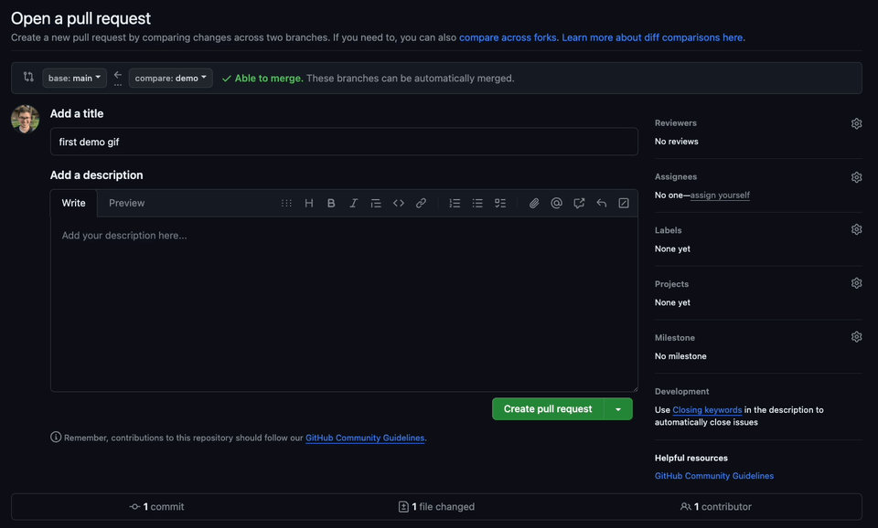

# github-pr-tables

> a chrome extension tools built with Vite + Vanilla, and Manifest v3

## What it does

This chrome extension will automatically place your PR attachments into a grid of your selected size.



## Installing

- Chrome Web Store link soon tm

## Developing

1. Check if your `Node.js` version is >= **14**.
2. Change or configurate the name of your extension on `src/manifest`.
3. Run `npm install` to install the dependencies.

run the command

```shell
$ cd github-pr-tables

$ npm run dev
```

### Chrome Extension Developer Mode

1. set your Chrome browser 'Developer mode' up
2. click 'Load unpacked', and select `github-pr-tables/build` folder

### Nomal FrontEnd Developer Mode

1. access `http://0.0.0.0:3000/`
2. when debugging popup page, open `http://0.0.0.0:3000//popup.html`
3. when debugging options page, open `http://0.0.0.0:3000//options.html`

## Packing

After the development of your extension run the command

```shell
$ npm run build
```

Now, the content of `build` folder will be the extension ready to be submitted to the Chrome Web Store. Just take a look at the [official guide](https://developer.chrome.com/webstore/publish) to more infos about publishing.

---

Generated by [create-chrome-ext](https://github.com/guocaoyi/create-chrome-ext)
